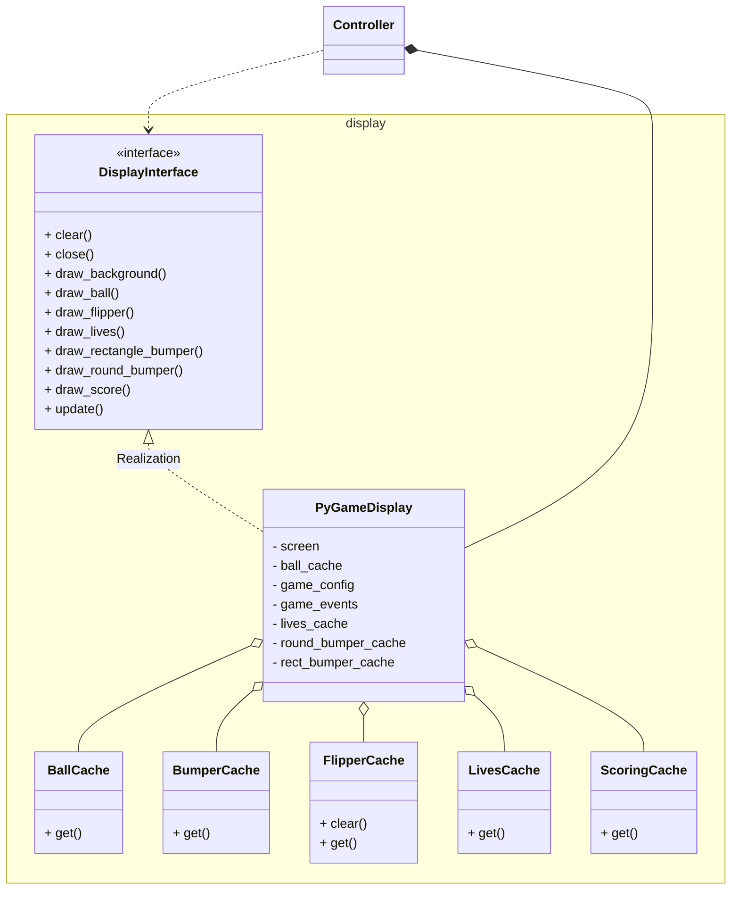

# Class Diagrams

## Display Component

Example diagram:

```mermaid
classDiagram

class Controller

namespace display {
class DisplayInterface{
    <<interface>>
    + clear()
    + close()
    + draw_background()
    + draw_ball()
    + draw_flipper()
    + draw_lives()
    + draw_rectangle_bumper()
    + draw_round_bumper()
    + draw_score()
    + update()
}

class PyGameDisplay {
    - screen
    - ball_cache
    - game_config
    - game_events
    - lives_cache
    - round_bumper_cache
    - rect_bumper_cache
}

class BallCache{
    + get()
}

class BumperCache {
    + get()
}

class FlipperCache {
    + clear()
    + get()
}

class LivesCache {
    + get()
}

class ScoringCache {
    + get()
}
}

DisplayInterface <|.. PyGameDisplay : Realization
PyGameDisplay o-- BallCache
PyGameDisplay o-- BumperCache
PyGameDisplay o-- FlipperCache
PyGameDisplay o-- LivesCache
PyGameDisplay o-- ScoringCache

Controller ..> DisplayInterface
Controller *-- PyGameDisplay
```
